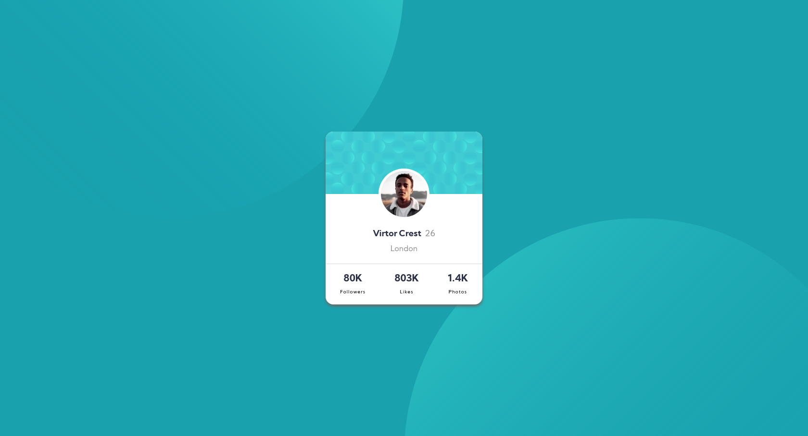

# Frontend Mentor - Profile card component solution

This is a solution to the [Profile card component challenge on Frontend Mentor](https://www.frontendmentor.io/challenges/profile-card-component-cfArpWshJ). Frontend Mentor challenges help you improve your coding skills by building realistic projects. 

## Table of contents

- [Overview](#overview)
  - [The challenge](#the-challenge)
  - [Screenshot](#screenshot)
  - [Links](#links)
- [My process](#my-process)
  - [Built with](#built-with)
  - [Useful resources](#useful-resources)
- [Author](#author)

## Overview

### The challenge

- Build out the project to the designs provided

### Screenshot

### Links

- Solution URL: [Solution URL here](https://keen-volhard-afbcd6.netlify.app/)

## My process

### Built with

- Semantic HTML5 markup
- CSS custom properties
- Flexbox
- Mobile-first workflow
- [Sass](https://sass-lang.com/) - CSS Compiler 

### Useful resources

- [css-tricks.com](https://css-tricks.com/snippets/css/a-guide-to-flexbox/) - This article helped me reinforce my knowledge of Flexbox.
- [netlify.com](netlify.com) - This platform supports me in seeing my project live.

## Author

- Website - [Hugo Calderón](https://hugocalderon.github.io/)
- Frontend Mentor - [@hugocalderon](https://www.frontendmentor.io/profile/hugocalderon)
